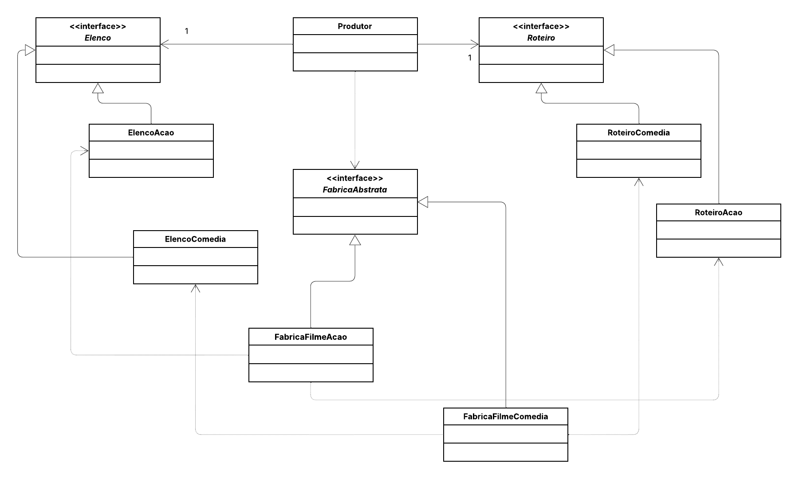

## 👩‍💻 Aluna:

**Maria Clara Ribeiro de Menezes**

---

# ⚙️ Projeto Abstract Factory – Produção de Filmes 🎬

Este projeto é uma **implementação do padrão de projeto Abstract Factory em Java**, utilizando um cenário de **produção cinematográfica**, no qual diferentes tipos de filmes (por exemplo, **Ação** e **Comédia**) são criados de forma organizada e independente.

A implementação demonstra como é possível **produzir famílias de objetos relacionados** (como **roteiro** e **elenco**) sem expor as classes concretas, mantendo o código **flexível e extensível**.

---

## 📖 Sobre o Padrão Utilizado

O **Abstract Factory** é um **padrão de criação** que tem como objetivo **fornecer uma interface para criação de famílias de objetos relacionados**, sem especificar suas classes concretas.

Em outras palavras, ele permite que o cliente trabalhe apenas com abstrações, enquanto as **fábricas concretas** decidem **quais objetos específicos** serão criados.

Neste projeto:
- O cliente é representado pela classe `Produtor`;
- As famílias de produtos são compostas por `Roteiro` e `Elenco`;
- As fábricas concretas (`FabricaFilmeAcao` e `FabricaFilmeComedia`) criam combinações compatíveis de objetos.

---

## 🎞️ Estudo de Caso

O sistema simula uma **produtora de cinema** que precisa criar filmes de diferentes gêneros.  
Cada gênero de filme possui um **roteiro** e um **elenco** específicos:

- A **Fábrica de Filme de Ação** cria:
    - `RoteiroAcao` → “Roteiro de Filme de Ação”
    - `ElencoAcao` → “Elenco de Atores de Ação escalado”

- A **Fábrica de Filme de Comédia** cria:
    - `RoteiroComedia` → “Roteiro de Filme de Comédia”
    - `ElencoComedia` → “Elenco de Atores de Comédia escalado”

Assim, o produtor pode criar filmes de diferentes tipos **sem modificar o código principal**, bastando alterar a fábrica utilizada.

---

## 📌 Diagrama de Classes

